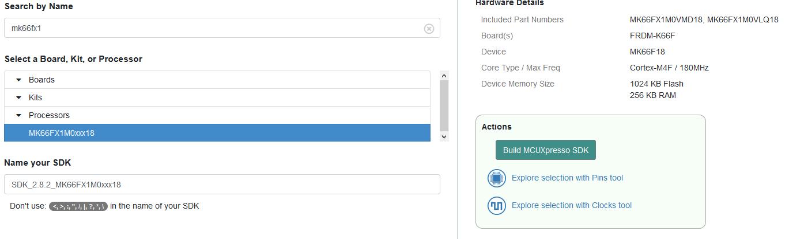
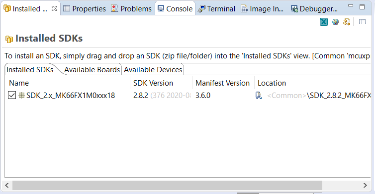

# Whistler Blackcomb Flight Computer Firmware

This is a repository with the code for the flight computer set up using MCUExpresso, not Arduino/Teensy. 

## Setup
### Download Tools
1. MCUExpresso

Download from [here](https://www.nxp.com/design/software/development-software/mcuxpresso-software-and-tools-/mcuxpresso-integrated-development-environment-ide:MCUXpresso-IDE?tab=Design_Tools_Tab). You will need an account, sign up for one for free. All the default options should be fine. 

2. Chip SDK

Go to [here](https://mcuxpresso.nxp.com/en/select), search for MK66FX1 and click on "Build MCUXpresso SDK. Select all and download SDK. Note that this might take a few minutes. 

After the SDK is installed open the Installed SDK window (if this isn't visible click Windows->Show View->Installed SDKs) on MCUXpresso and drag the SDK zip file. 

Since this process is a bit of a pain and takes a while, the SDK is also available [here](https://drive.google.com/file/d/1W3uJRgZEQmULOGBuqZKy3pOs45sVxxFm/view?usp=sharing) on the Google Drive. Note that might not be consistently updated so ideally download using method above. 

### Setup Project

Click File->Import, select Git->Projects from Git (with smart import) and select Clone URI. Enter appropriate information and project should import. Note that you can use console git (wsl, git bash, etc.) but importing the project to the workspace is a bit confusing so it's easier to use the UI. 

## Upload 

For now since we're prototyping on a Teensy 3.6 and can't use an external programmer we're using a Teensyduino to upload the HEX file. Note that once the flight computer PCB is completed we'll be able to upload directly. To upload using this method follow [this guide](doc/1-Teensy-Upload.md). 

## Project Documentation

All documentation are currently kept in the /doc folder. 

1. Uploading to Teensy [guide](doc/1-Teensy-Upload.md).
2. freeRTOS installation and usage [guide](doc/2-RTOS-Basics.md).
2. x86 Compilation explanation and setup [guide](doc/3-x86-compilation.md)
