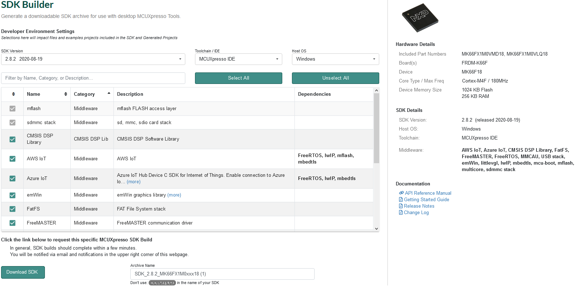

# Whistler Blackcomb Flight Computer Firmware

This is a repository with the code for the UBC Rocket Whistler Blackcomb flight computer. A compiled version of it should hopefully at some point be in [space](https://en.wikipedia.org/wiki/K%C3%A1rm%C3%A1n_line). 

## Setup
### Download Tools
1. MCUXpresso

Download from [here](https://www.nxp.com/design/software/development-software/mcuxpresso-software-and-tools-/mcuxpresso-integrated-development-environment-ide:MCUXpresso-IDE?tab=Design_Tools_Tab). You will need an account, sign up for one for free. All the default options should be fine. 

2. Chip SDK

Go to [here](https://mcuxpresso.nxp.com/download/78d26642c8a4ca1efecebe0f36145702) and download it. If that doesn't work for some reason you can also get the SDK package yourself [here](https://mcuxpresso.nxp.com/en/select), search for MK66FX1 and click on "Build MCUXpresso SDK. Select all and download SDK. Note that this might take a few minutes. 

After the SDK is installed open the Installed SDK window (if this isn't visible click Windows->Show View->Installed SDKs) on MCUXpresso and drag the SDK zip file. 

### Setup Project

Click File->Import, select Git->Projects from Git (with smart import) and select Clone URI. Enter appropriate information and project should import. Note that you can use console git (wsl, git bash, etc.) but importing the project to the workspace is a bit confusing so it's easier to use the UI. 

## Project Documentation

All documentation are currently kept in the [doc/](doc/) directory. 

1. Uploading to Teensy [guide](doc/1-Teensy-Upload.md).
2. freeRTOS installation and usage [guide](doc/2-RTOS-Basics.md).
3. x86 Compilation explanation and setup [guide](doc/3-x86-Compilation.md). 
4. How continout integration works and how to access ours in this [guide](doc/4-Continuous-Integration.md). 
5. Setting up Windows compilation [guide](doc/5-Windows-Compilation-with-Cygwin.md). 
6. Radio system [guide](doc/6-Radio.md). 
7. CAN communication [guide](doc/7-CAN.md)