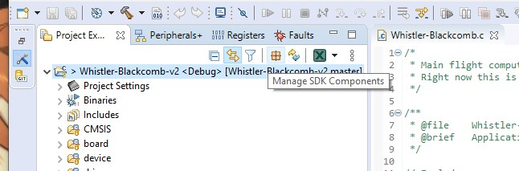
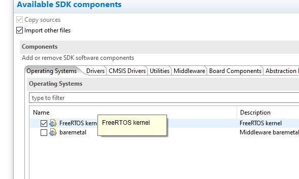

# RTOS basics

## RTOS Installation

To set up a new project with RTOS built-in, follow [this guide](https://community.nxp.com/t5/Kinetis-Software-Development-Kit/How-to-create-an-FreeRTOS-project-with-MCUXpresso-IDE/ta-p/1107710)

If you have an existing project and want to switch to add RTOS:

First click on the project and open the SDK manager. (FYI this is how you can access most information you select on project setup.)



Next, check the FreeRTOS box under Operating System tab. Also check "import other files". Click ok and apply.




## freeRTOS usage

Include relevant headers.

```C
#include "FreeRTOS.h"
#include "task.h"
```

Define a function that contains what your task does. Make sure you use the correct delay and other timer-related functions.

```C
/* simple task */
static void MyTask(void *pv) {
    //Do stuff
   	vTaskDelay(pdMS_TO_TICKS(1000)); //1000ms delay
    
}
```

In the main loop, create task (allocate memory) and start task scheduler.

```C
if (xTaskCreate(  /* create task */
        MyTask,  /* pointer to the task */
        "App", /* task name for kernel awareness debugging */
        200/sizeof(StackType_t), /* task stack size */
        (void*)NULL, /* optional task startup argument */
        tskIDLE_PRIORITY+2,  /* initial priority */
        (TaskHandle_t*)NULL /* optional task handle to create */
      ) != pdPASS) {
       for(;;){} /* error! probably out of memory */
}

vTaskStartScheduler(); //start running tasks
```

Read more at the freeRTOS API documentation [here](https://www.freertos.org/a00106.html). A very good and easy to read guide on general usage can be found [here](https://www.freertos.org/fr-content-src/uploads/2018/07/161204_Mastering_the_FreeRTOS_Real_Time_Kernel-A_Hands-On_Tutorial_Guide.pdf). 

## Misc. RTOS Notes
* Do not dynamically allocate memory/arrays inside tasks
  * This will mess with execution flow and cause tasks to fail
  * If you really need to there are special functions to do so
  * For example, **do not** do either of the following inside the task: 
```C
int arr[20];
int* arr = (int*) malloc(20 * sizeof(int));
```
