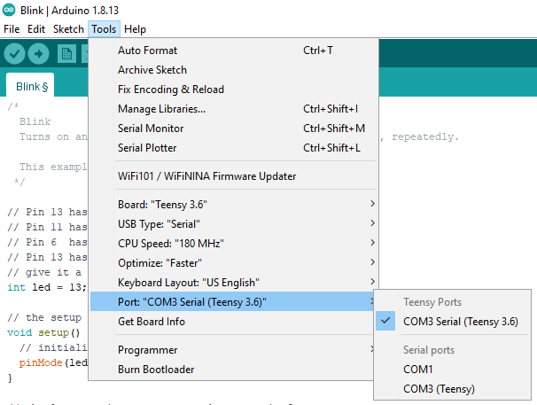
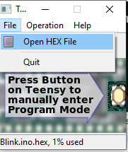

# Teensy Upload

Since the Teensy bootloader chip interferes with an external programmer during runtime, the only option to upload to a Teensy is to use Teensyduino (with the MCUXpresso generated hex file). To do so follow this guide. 

## Tools

### Windows

In the project structure, got to [tools](../tools) and open [teensy.exe](https://www.pjrc.com/teensy/teensy.exe) (from [PJRC](https://www.pjrc.com/teensy/loader_xp.html)). If it doesn't work Linux option below can also be used for Windows, this is just a bit easier. 

### Linux

#### Arduino IDE

Download IDE [here](https://www.arduino.cc/en/main/software). Run installer, default options are fine. Not that Arduino IDE isn't actually being used, it's just used for Teensyduino so it's installation really doesn't matter. 

#### Teensyduino

Download [here](https://www.pjrc.com/teensy/td_download.html). Similarly to Arduino IDE installation options don't really matter so default options are fine. 

## Upload

If you're not opening Teensyduino directly, first open Arduino IDE and select Tools->Port->COM X, where X is whatever port Teensy is on (should be labelled). 

Press upload (doesn't matter what program), and Teensyduino should pop up. When this happens, or when the Teensy programmer is opned, click File->Open Hex file and select hex file generated by MCUXpresso (in Debug folder). Press program button on button and program should upload. 

