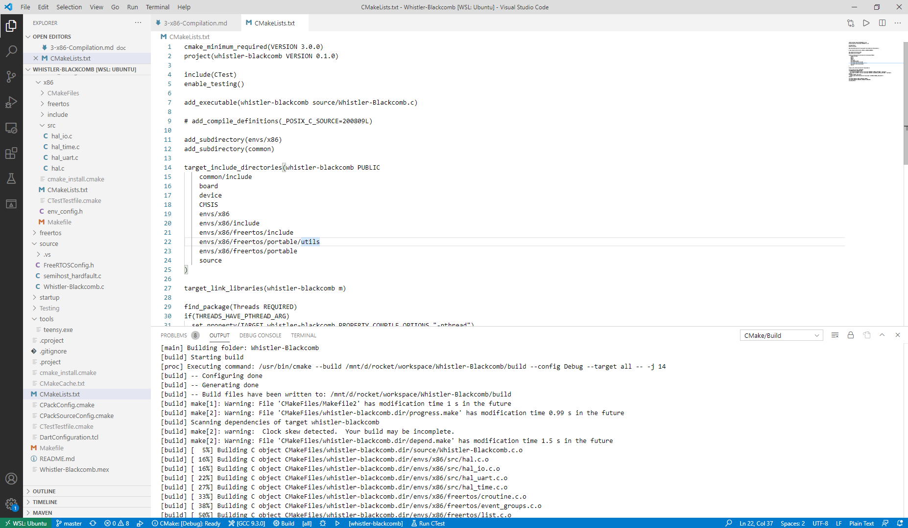

# x86 Compilation

## Working Principles

### Purpose

For more comprehensive testing, this entire project can be compiled for the x86 architecture in addition to the FRK66f chip that is on the flight computer. This lets the code be tested both in a standalone manner and lets it be integrated with the ground station python setup. 

To enable this, two seperate build systems are used. MCUXpresso is used for the board compilation, and this enables the use of many built in functionality such as pin assignment and others that are quite useful. For x86 compilation, CMake is used instead. Both system share more of their source code, but a hardware abstraction layer is implemented with different implementations for each. For example, if a task was to toggle a pin repeatedly (i.e. blink example), both compilations would share their main task source code. Each time it was time to toggle the pin, that task would call a function from the hardware abstraction layer. If it's the physical board calling it the abstraction layer would physically toggle the pin output, but if it was a desktop running it the abstraction layer would do something different, such as logging the even to a file. This way the "task" is running the exact same, just the output is different. 

### File Structure

The way that this is accomplished is by using a different set of includes for each compilation. These two sets of includes are in the [envs](../envs) folder. Each has a seperate set of implementations for extremely similar implementations of the hardware abstraction layer, abbreviated HAL. For example, the toggle example above would have the implementation for the physical board as the [hal_io.h](../envs/board/include/hal_io.h) file in the board folder but for x86 compilation it would be [hal_io.h](../envs/x86/include/hal_io.h) in the x86 folder. The [CMakeLists.txt](../CMakeLists.txt) specifies x86 HAL files to be included, and a similar functionality is achieved through MCUXpresso. All code that we've written that is common between the two applications is in the [common](../common) folder, with the exception of the main executable file which is ine [source](../source). 

## Setup

Note: this is by no means the only way of setting this up. If you'd prefer to run CMake solely from the CLI that definitely works and by all means go ahead, this is just the setup I used and might make it easier. 

### Download tools

1. Linux

Right now, only Linux build is supported. This is something that should be fixed soon, but for now if you're on windows please download and set up Windows Subsystem for Linux (wsl). [This](https://docs.microsoft.com/en-us/windows/wsl/install-win10) is a very good guide and should walk you through it. If it doesn't work bug me (Xander) to set up Windows freeRTOS for this compilation. 

2. VSCode

Download however you want. If using wsl just download windows version and call it from wsl. [Download link](https://code.visualstudio.com/download). 

3. VSCode extensions

Open vscode in linux, go to extensions tab and install C/C++ and CMake Tools


Make sure you have cmake installed by opening terminal and typing 

```
cmake --version
```

If not installed install it with (or with whatever your package manager of choice)

```
sudo apt install cmake
```

### Build Project

Open main project folder in vscode, and cmake should automatically configure. Press F7 to build (or build button on bottom ribbon to build). There should be no errors building. To run either execute build file in the [build](../build) folder or use run/debug button on bottom ribbon. 



### Troubleshooting
If you are using Ubuntu and get an error along the lines of 
```
No CMAKE_C_COMPILER could be found.
No CMAKE_CXX_COMPILER could be found.
```
try running 
```
sudo apt-get update && sudo apt-get install build-essential
```
and then try building again. 
