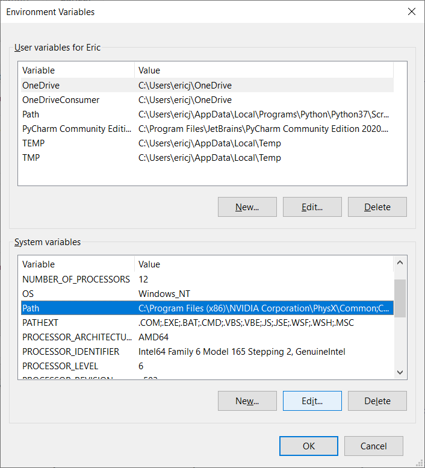

This doc covers setting up visual studio code and cygwin to create a `.exe` file for windows. 

# Install Cygwin
Cygwin is "a large collection of GNU and Open Source tools which provide functionality similar to a Linux distribution on Windows and 
a DLL (cygwin1.dll) which provides substantial POSIX API functionality", which we'll need.

From https://www.cygwin.com/, select `Install Cygwin by running setup-x86_64.exe`, download, and run the executable to start the install wizard.

# Configuring Cygwin Installation
Under 'Choose a download source', select 'install from internet'


Leave the default settings unchanged for
* Select Root Install Directory
* Select Local Package Directory
* Select Your Internet Connection

and select any mirror of your choice for 'choose a download site'. 

Select 'next' to begin the installation

# Installing Packages
Once the 'select packages' screen appears, change the view to 'full' and search for `gcc-core`.

Find `gcc-core` under packages and in the `new` column, select the most recent version.

*Note that you should not select `cygwin32-gcc-core` or any other similary named package that is not exactly `gcc-core`.*


Follow the same steps as above and select the latest versions of `gcc-g++`, `cmake`, and `make`.

If you want to be able to use VSCode's built-in debugger, you'll need to install the `gdb` package as well.

Select 'next' and confirm your instalations. Other packages required by `gcc-core`,`gcc-g++`, `cmake`, `make`, and (optionally) `gdb` will be installed as well. Select next again to install. Select 'Finish' to complete the instalation. 

# Adding Cygwin to Path
Use the Windows start menu search to search for 'environment' and select 'edit the system environment variables', or find it from `Control Panel>System and Security>System>Advanced System Settings`. Click on 'Environment Variables...'

Under 'System variables', select `Path` and choose 'Edit'


Choose 'browse' and find the location of the Cygwin `bin` directory; it should be by default `C:\cygwin64\bin`. 

Confirm that Cygwin is in path, and restart your computer.

# Configure Visual Studio Code
Navagate in Powershell (or equivalant) to the directory you created above and launch Visual Studio Code with `code .`.

Ensure that you have the VSCode addons:
* `C/C++`
* `CMake`
* `CMake Tools`

In VSCode, change the kit to GCC x.x.x. 

You should now be able to build a `.exe`!

# Compliling for Linux and Windows from the Same Directory
If you are building for Linux and Windows from the same place, you'll need to delete the `build/CMakeCache.txt` file when you switch between the two. Alternatively, you can select ```Cake: Delete Cache and Reconfigure``` from the command search (accessable with the 'F' key).

# Issues
If this isn't working, contact Xander or Eric on slack. Hopefully they can figure out where Eric messed up this documentation!

### Known Issues:

- VSCode might not properly execute tests if compiling in this mode. The tests should still all compile fine, and you can run them individually, but you just can't use the handy `run CTest Tests` button.
