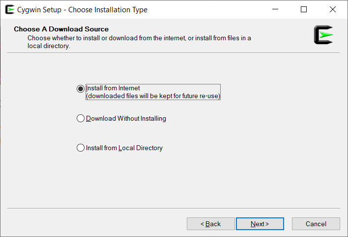
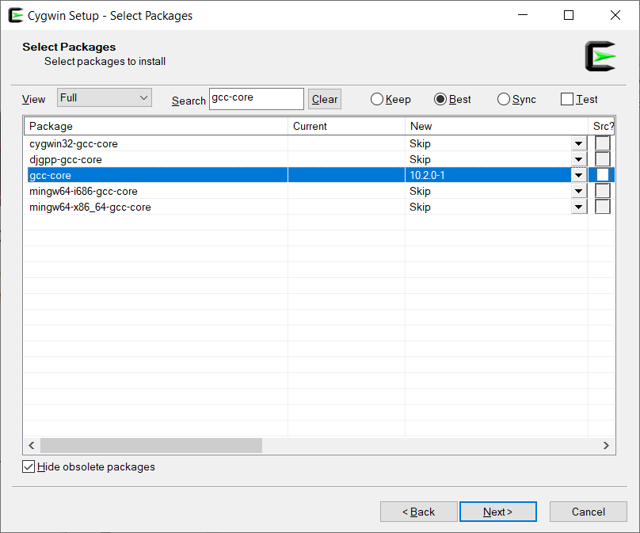

# Purpose
This doc covers setting up visual studio and cygwin to create a `.exe` file for windows. 

# Create a separate repository
For now, at least, we think it's best to use separate repository for the windows compilation and linux compilation. 
Create a new reposityory with `git pull` or `git clone`.

# Install Cygwin
Cygwin is "a large collection of GNU and Open Source tools which provide functionality similar to a Linux distribution on Windows and 
a DLL (cygwin1.dll) which provides substantial POSIX API functionality", which we'll need.

From https://www.cygwin.com/, select `Install Cygwin by running setup-x86_64.exe`, download, and run the executable to start the install wizard.

# Configuring Cygwin Installation
Under 'Choose a download source', select 'install from internet'

Leave the default settings unchanged for
* Select Root Install Directory
* Select Local Package Directory
* Select Your Internet Connection

and select any mirror of your choice for 'choose a download site'. 

Select 'next' to begin the installation

# Installing Packages
Once the 'select packages' screen appears, change the view to 'full' and search for `gcc-core`.

Find `gcc-core` under packages and in the `new` column, select the most recent version.

*Note that you should not select `cygwin32-gcc-core` or any other similary named package that is not exactly `gcc-core`.*

Follow the same steps as above and select the latest versions of `gcc-g++`, `cmake`, and `make`.

Select 'next' and confirm your instalations. Other packages required by the `gcc-core`,`gcc-g++`, `cmake`, and `make` will be installed as well. Select next again to install. Select 'Finish' to complete the instalation. 

# Adding Cygwin to PATH
Search windows for 'environment' and select 'edit the system environment variables', or find it 
