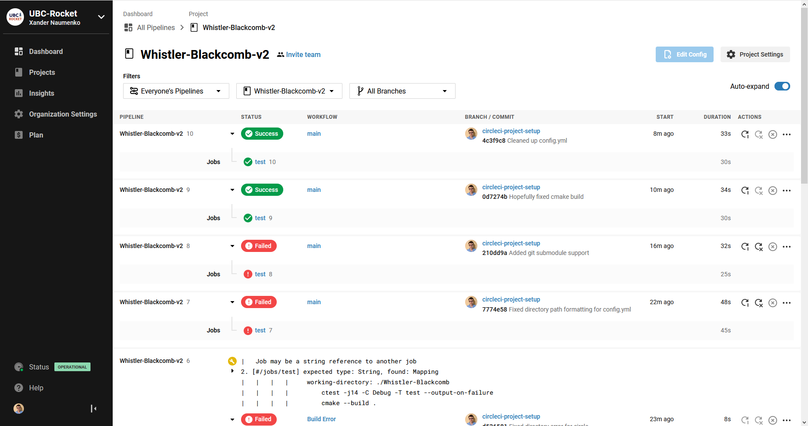

# Continuous Integration

## What it is

Continuous integration is where code is integrated into a fully working and stable form on a rolling basis, which enables much faster and easier development. What it means in practice is making sure that the master branch is always in a stable and working form through automated testing/builds, and at no point does someone submit a pull request that "breaks the build " as it were. 

To enable this, we're using CircleCI, a free service that allows you to do automated testing everytime a pull request/push to master is made. That way even if it compiles on your machine, a remote server confirms that everything is actually working as intended and it will actually build. 

## Access

To get access, log in to circleci.com and give access to your github account. Assuming you are part of the UBC-Rocket organization, you should see this repository and its build status. 

## Configuration

Configuration of the Travis CI build is done through the [config.yml](../.circleci/config.yml) file. Any terminal commands you would run on your local machine (assuming you're running linux/wsl) can be run remotely. 
