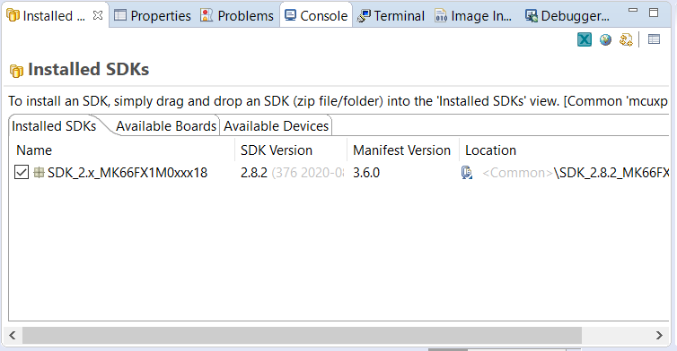

## Setup
### Download Tools
1. MCUXpresso

Download from [here](https://www.nxp.com/design/software/development-software/mcuxpresso-software-and-tools-/mcuxpresso-integrated-development-environment-ide:MCUXpresso-IDE?tab=Design_Tools_Tab). You will need an account, sign up for one for free. All the default options should be fine.

**Important:**
Unless otherwise noted, select version 11.2.1. This ensures we all have the same versions and don't run into any versioning issues. 


If you're an Arch user MCUXpresso really doesn't like installing itself, so you have to install it manually. To do so use the following PKGBUILD file (mostly taken from the AUR PKGBUILD which is for a newer version): 

```
# BUILD INSTRUCTIONS:
#
# 1. Log in to nxp.com
# 2. Go to https://www.nxp.com/design/software/development-software/mcuxpresso-software-and-tools-/mcuxpresso-integrated-development-environment-ide:MCUXpresso-IDE
# 3. Click on "Download" and download the current version
# 4. Accept the License terms
# 5. Download the .deb.bin package and place it in the same directory as the PKGBUILD
# 6. Build!
#
#

pkgname=mcuxpresso-ide
pkgver=11.2.1_4149
pkgrel=1
epoch=
pkgdesc="An easy-to-use integrated development environment (IDE) for creating, building, debugging, and optimizing your application. From BIN package distributed by NXP."
arch=('x86_64')
url="http://www.nxp.com/MCUXPresso"
license=('custom:"NXP"')
depends=('ncurses' 'glibc' 'lib32-glibc' 'jlink-software-and-documentation' 'dfu-util' 'libusb')

source=("file://mcuxpressoide-${pkgver}.${arch}.deb.bin")
noextract=("mcuxpressoide-${pkgver}.${arch}.deb.bin")
sha256sums=('SKIP')
options=('!strip')

prepare() {
    chmod +x mcuxpressoide-${pkgver}.${arch}.deb.bin
    ./mcuxpressoide-${pkgver}.${arch}.deb.bin --noexec --keep --target ${srcdir}
    rm mcuxpressoide-${pkgver}.${arch}.deb.bin
    cd ${srcdir}/
    mkdir mcuxpressoide
    bsdtar -x -f mcuxpressoide-${pkgver}.${arch}.deb -C mcuxpressoide/
    rm mcuxpressoide-${pkgver}.${arch}.deb
    bsdtar -x -f mcuxpressoide/data.tar.gz -C mcuxpressoide/
    rm mcuxpressoide/data.tar.gz
    rm JLink_Linux_x86_64.deb
    rm ${srcdir}/mcuxpressoide/usr/local/mcuxpressoide-${pkgver}/JLink_Linux_x86_64.deb
    # Rename main folder in place
    mv ${srcdir}/mcuxpressoide/usr/local/mcuxpressoide-${pkgver} ${srcdir}/mcuxpressoide/usr/local/${pkgname};
    # Update link in desktop file
    cat ${srcdir}/mcuxpressoide/usr/share/applications/com.nxp.mcuxpressoide.desktop | sed "s/mcuxpressoide-${pkgver}/mcuxpresso-ide/" > ${srcdir}/mcuxpressoide/usr/share/applications/com.nxp.mcuxpressoide.desktop.1
    cat ${srcdir}/mcuxpressoide/usr/share/applications/com.nxp.mcuxpressoide.desktop.1 | sed "s/usr\/local/opt/" > ${srcdir}/mcuxpressoide/usr/share/applications/com.nxp.mcuxpressoide.desktop
}


package() {
    # Copy main folder in place
    cp -ar ${srcdir}/mcuxpressoide/usr ${pkgdir}/;
    # Move application files to /opt as they don't obey standard file system hierarchy
    mv ${pkgdir}/usr/local ${pkgdir}/opt;
    # Copy licenses of software components (FreeRTOS, Java etc.) accarding to system directory structure
    mkdir ${pkgdir}/usr/share/licenses
    cp -ar ${pkgdir}/opt/mcuxpresso-ide/licenses ${pkgdir}/usr/share/licenses/${pkgname}
    # Copy udev rules from /lib to /usr/lib folder
    cp -ar ${srcdir}/mcuxpressoide/lib/udev ${pkgdir}/usr/lib/;
    # Add Product LICENSE file to licenses folder
    install -D -m644 ${srcdir}/ProductLicense.txt ${pkgdir}/usr/share/licenses/${pkgname}/ProductLicense.txt;
}
```

2. Chip SDK

Go to [here](https://mcuxpresso.nxp.com/download/9ba397a99467670531f186cddcf1b1a4) and download it. If that doesn't work for some reason you can also get the SDK package yourself [here](https://mcuxpresso.nxp.com/en/select), search for MK66FX1 and click on "Build MCUXpresso SDK. Select all and download SDK. Note that this might take a few minutes. 


After the SDK is installed open the Installed SDK window (if this isn't visible click Windows->Show View->Installed SDKs) on MCUXpresso and drag the SDK zip file. 



### Setup Project

Click File->Import, select Git->Projects from Git (with smart import) and select Clone URI. Enter appropriate information and project should import. Note that you can use console git (wsl, git bash, etc.) but importing the project to the workspace is a bit confusing so it's easier to use the UI. 


# Opening the Program and Editing Source Code:
1. Open the Program
2. Create a workspace in your Documents Folder or wherever you want to do your work. This isn't the Project Repository, but rather a location for reference for the program. MCUXpresso allows you to open a workspace where you can have multiple projects that share the same settings, hence it's better to have it separate from our source code. I use the path `"/Users/davin/ubcRocket/wb_avionics/firmware"` that I made for my workspace and Rocket work.


3. Close the welcome screen by clicking "IDE".


4. Then, select "Import a Project from file system." You can copy the project into the workspace but that's optional.
5. You will know it's correctly working if you can see all of our Whistler Blackcomb source files in the Project Explorer.


If you get an error saying "Some projects cannot be imported because they already exist in the workspace error in Eclipse" then uncheck the box labelled "copy projects into workspace" and try again. Once you have it working you can use your terminal to use Git and follow our normal methods for version control.


# Building Source:

Ensure that any changes you make to files shared by x86 and our Board compile without errors by doing a Build in MCUXpresso. This compiles for the Board enviroment instead of the x86 environment we build for in VSCode.

You should select "Whistler-Blackcomb" (or a file within it) on the Project Explorer (if not visible, select Window -> Show View -> Project Explorer):


And then click build in the Quickstart Panel.


# Pin Configuration View:
To be able to configure the pins on the MK66F you press the button that has the little green plus mark on it to add a new view to the workspace:


Here it will ask you what you want configure and this was the setup I was guided to:


You should now have access to this view and be able to modify anything if you need to.

When done, press the funny-looking and green 'Update Code' button to set all these changes to our project.


# Adding SDK Examples:
When we want to add implement features to the board that exist on the chip, the best way to do it is to do as close as possible to what the developer has intended.
As an example I'm adding the ADC SDK:

1. Select Import SDK Examples:
 
 
2. Select the only board that shows up. This was set when we initially set up the IDE.


3. Under Driver Examples select the available SDKs you wish to use:


4. For the Advanced Settings, press finish to continue with the Defaults.


When porting over the Example, try to keep it as concise as you can minimizing copying over anything unnecessary. One method is to comment out parts of the example and continually build it to see how much you can strip away. If do need it we can come back and get it, but most is setting up one of many different implementations.

